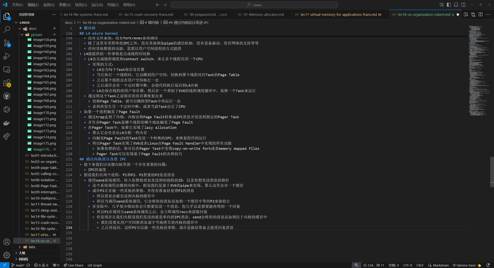

# 操作系统隔离性

+ 操作系统存在的一个意义，就是让各种资源隔离，从而防止别的程序篡改这个程序的内容
+ 进程本身不是CPU，但是它们对应了CPU
  + 应用程序不能直接与CPU交互，只能与进程交互
  + 操作系统内核会完成不同进程在CPU上的切换
--------
例子1：
+  执行exec系统调用 >> 找到对应的内存镜像 >> 内存镜像里面包括了程序对应的指令、数据
   +  应用程序可以逐渐扩展自己的内存
   +  但是应用程序不能直接访问物理内存
-----------
例子2：
+ 应用程序不会直接读写挂在计算机上的磁盘本身
+  与存储系统交互的唯一方式就是通过files
+  之后，操作系统会决定如何将文件与磁盘中的块对应
   +  确保一个磁盘块只出现在一个文件中
   +  确保用户A不能操作用户B的文件

# 操作系统的防御性

+ 正所谓“总有刁民想害朕”
+ 操作系统需要具备防御性，那么在应用程序和操作系统之间需要有一堵厚墙
+ 需要通过硬件来实现强隔离性
+ 硬件对于强隔离的支持包括了：
  + user/kernle mode
    + 为了支持user/kernel mode，处理器会有两种操作模式：
      + user mode——CPU可以运行特定权限的指令
        + 一些直接操纵硬件的指令和设置保护的指令
        + 例如设置page table寄存器、关闭时钟中断
      + kernel mode——CPU只能运行普通权限的指令
        + 普通权限指令：例如将两个寄存器相加的指令ADD、将两个寄存器相减的指令SUB、跳转指令JRC、BRANCH指令
  + 虚拟内存
    + 操作系统会设置page table，使得每一个进程都有不重合的物理内存
    + 这样一个进程就不能访问其他进程的物理内存
------
user/kernel mode是分隔用户空间和内核空间的边界
+ 用户空间运行的程序运行在user mode
+ 内核空间的程序运行在kernel mode
+ 操作系统位于内核空间

+ 但这样分，泾渭分明，又显得太不近人情，有时候，确实需要内核的一些权限
+ 需要有一种方式能够让应用程序可以将控制权转移给内核
+ 在RISC-V中，有一个专门的指令用来实现这个功能，叫做ECALL
  + 当它在用户空间执行fork时 >>
  + 它并不是直接调用操作系统中对应的函数，而是调用ECALL指令
  + 并将fork对应的数字作为参数传给ECALL
  + 之后再通过ECALL跳转到内核
+ **用户空间和内核空间的界限是一个硬性的界限，用户不能直接调用fork，用户的应用程序执行系统调用的唯一方法就是通过这里的ECALL指令**

同理：
+ 假设要调用write，相应的流程是类似的>>
  + write不能直接调用内核中的write代码
  + 而是由封装好的系统调用函数执行ECALL指令 >> 所以write函数实际上调用的是ECALL指令
  + 指令的参数是代表了write系统调用的数字
  + 之后控制权到了syscall函数，syscall会实际调用write系统调用
------
+ 所以，总结上面说到的方法：
  + 通过系统调用或者说ECALL指令，将控制权从应用程序转到操作系统中
  + 之后内核负责实现具体的功能并检查参数以确保不会被一些坏的参数所欺骗
+ 所以内核有时候也被称为可被信任的计算空间（Trusted Computing Base）
  + 在一些安全的术语中也被称为TCB
+ 要被称为TCB：
  + 内核首先要是正确且没有Bug的
    + 假设内核中有Bug，攻击者可能会利用那个Bug，并将这个Bug转变成漏洞，这个漏洞使得攻击者可以打破操作系统的隔离性并接管内核
  + 内核必须要将用户应用程序或者进程当做是恶意的

此时就存在了一种悖论——安全和性能的取舍

|区分|典型代表|内核代码数量|性能|安全性|
|:-----|:-----:|:---:|:----:|:----:|
|宏内核|桌面操作系统，比如Linux|多|高|低|
|微内核|嵌入式操作系统，MINIX|少|低|高|

# 编译运行kernel
+ 内核编译的过程：
  + 第一步：Makefile（XV6目录下的文件）会读取一个C文件，例如proc.c
  + 第二步：调用gcc编译器，生成一个文件叫做proc.s，这是RISC-V 汇编语言文件
  + 第三步：再走到汇编解释器，生成proc.o，这是汇编语言的二进制格式
+ Makefile会为所有内核文件做相同的操作
  + 比如说pipe.c，会按照同样的套路，先经过gcc编译成pipe.s，再通过汇编解释器生成pipe.o
+ 之后，系统加载器（Loader）会收集所有的.o文件，将它们链接在一起，并生成内核文件
  + 这里生成的内核文件就是我们将会在QEMU中运行的文件
  + Makefile还会创建kernel.asm，这里包含了内核的完整汇编语言，可以通过它来定位究竟是哪个指令导致了Bug

